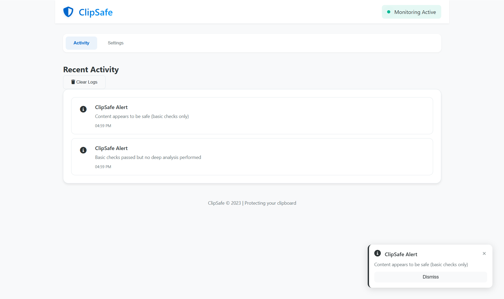

# ClipSafe

ClipSafe is a beautiful, modern desktop application that monitors your clipboard for potentially harmful content. It uses pattern matching and AI-powered analysis to detect suspicious URLs, commands, and code snippets before they can cause harm.



## Features

- **Real-time Clipboard Monitoring**: Automatically checks clipboard content for safety
- **AI-Powered Analysis**: Uses Groq AI to analyze content for potential threats
- **Beautiful UI**: Modern, minimal interface with real-time notifications
- **System Tray Integration**: Runs in the background with easy access
- **Detailed Logs**: Keep track of all clipboard activities and security events
- **Customizable Settings**: Configure your security preferences

## Installation

### Prerequisites

- Node.js (v14 or higher)
- Python 3.8 or higher
- npm or yarn

### Setup

1. Clone the repository:

   ```
   git clone https://github.com/yourusername/clipsafe.git
   cd clipsafe
   ```

2. Install Node.js dependencies:

   ```
   npm install
   ```

3. Install Python dependencies:

   ```
   cd python
   pip install -r requirements.txt
   cd ..
   ```

4. Start the application:
   ```
   npm start
   ```

## Building for Distribution

To build the application for distribution:

```
npm run build
```

This will create distributable packages in the `dist` directory.

## Configuration

### Groq API Key

For enhanced AI-powered analysis, you can add your Groq API key in the settings tab. Without an API key, the application will still work but will rely solely on pattern matching for security checks.

## Usage

1. Launch ClipSafe
2. The application will start monitoring your clipboard automatically
3. When you copy or paste content, ClipSafe will analyze it for safety
4. If potentially harmful content is detected, you'll receive a notification
5. View detailed logs and statistics in the dashboard

## Security Features

ClipSafe detects:

- Malicious URLs and suspicious links
- Dangerous terminal commands
- Potentially harmful code snippets
- Phishing attempts
- Other security concerns

## License

MIT

## Acknowledgements

- [Electron](https://www.electronjs.org/)
- [Groq AI](https://groq.com/)
- [Font Awesome](https://fontawesome.com/)
